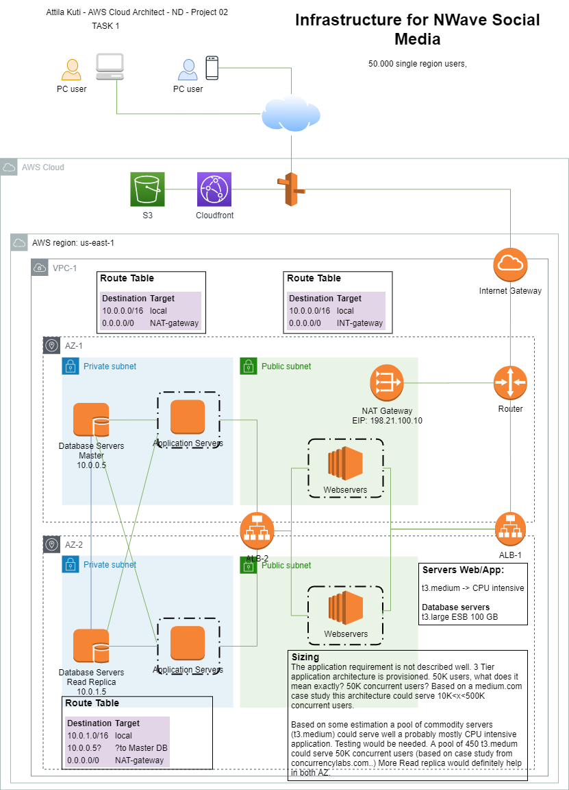

Project 02 - Attila Kuti
=================================

This READ ME file simply shows the results and adds some comments.


### Questions from my side
1. I could not find Cloud trail logs in CSV format! Where should i find it. [See details here](#cloudtrail-log)
2. My cost monitoring alarm remains in insufficient data state. Why? [See details here](#cost-monitoring)
3. I could not find Logs for lambda. Why [See details here](#lambda-logs)
4. What is the exercise about the VPC and EC2 instances in connection with the lambda function?


# Task 1 Social Media application for 50K
## Part 1 - Diagram with Servers:



## Part 2 - Diagram with Serverless solution:


# Task 2 Cost Estimates for Social Media Infra

## Initial Cost estimate
(csv file also attached)

```
Group hierarchy,Region,Description,Service,Upfront,Monthly,First 12 months total,Currency,Configuration summary
My Estimate,US East (N. Virginia),,Amazon EC2,0,9473.85,113686.20,USD,"Operating system (Linux), Quantity (450), Pricing strategy (EC2 Instance Savings Plans 1 Year No Upfront), Storage for each EC2 instance (General Purpose SSD (gp2)), Storage amount (20 GB), Instance type (t3.medium)"
My Estimate,US East (N. Virginia),,S3 Standard,0,109.54,1314.48,USD,S3 Standard storage (800 GB per month)
My Estimate,US East (N. Virginia),,Data Transfer,0,92.07,1104.84,USD,"DT Inbound: Not selected (0 TB per month) 
, DT Outbound: Internet (1 TB per month) 
, Data transfer cost (92.07)"
My Estimate,US East (N. Virginia),,Amazon Virtual Private Cloud (VPC),0,78.93,947.16,USD,Number of NAT Gateways (1)
My Estimate,US East (N. Virginia),,Elastic Load Balancing,0,873.8100000000001,10485.72,USD,Number of Application Load Balancers (2)
My Estimate,US East (N. Virginia),,Amazon RDS for MySQL,0,185.49200000000002,2225.90,USD,"Quantity (2), Pricing strategy (Standard Reserved Instances 1 Year No Upfront), Storage for each RDS instance (General Purpose SSD (gp2)), Storage amount (199 GB), Instance type (db.t3.large)"


Acknowledgement
"* AWS Pricing Calculator provides only an estimate of your AWS fees and doesn't include any taxes that might apply. Your actual fees depend on a variety of factors, including your actual usage of AWS services."


```

## Reduced Cost estimate
(csv file also attached)

```
Group hierarchy,Region,Description,Service,Upfront,Monthly,First 12 months total,Currency,Configuration summary
My Estimate,US East (N. Virginia),,Amazon EC2,0,5052.72,60632.64,USD,"Operating system (Linux), Quantity (240), Pricing strategy (EC2 Instance Savings Plans 1 Year No Upfront), Storage for each EC2 instance (General Purpose SSD (gp2)), Storage amount (20 GB), Instance type (t3.medium)"
My Estimate,US East (N. Virginia),,S3 Standard,0,109.54,1314.48,USD,S3 Standard storage (800 GB per month)
My Estimate,US East (N. Virginia),,Data Transfer,0,92.07,1104.84,USD,"DT Inbound: Not selected (0 TB per month) 
, DT Outbound: Internet (1 TB per month) 
, Data transfer cost (92.07)"
My Estimate,US East (N. Virginia),,Amazon Virtual Private Cloud (VPC),0,78.93,947.16,USD,Number of NAT Gateways (1)
My Estimate,US East (N. Virginia),,Elastic Load Balancing,0,873.81,10485.72,USD,Number of Application Load Balancers (2)
My Estimate,US East (N. Virginia),,Amazon RDS for MySQL,0,185.492,2225.9,USD,"Quantity (2), Pricing strategy (Standard Reserved Instances 1 Year No Upfront), Storage for each RDS instance (General Purpose SSD (gp2)), Storage amount (199 GB), Instance type (db.t3.large)"
,,,,,,,,
,,,,,,,,
,,,,,,,,
Acknowledgement,,,,,,,,
"* AWS Pricing Calculator provides only an estimate of your AWS fees and doesn't include any taxes that might apply. Your actual fees depend on a variety of factors, including your actual usage of AWS services.",,,,,,,,
,,,,,,,,
"CHANGE made: Number of EC2 instances were moved down (maximized) in 240 -> might be improper estimate to meet the user requirements. Possibly higher response times, more CPU usage, EVEN higher costs because of different CPU credit usage! (max 40% CPU usage was planned with 450 instances..)",,,,,,,,

```

## Increased Cost estimate
(csv file also attached)

```
Group hierarchy,Region,Description,Service,Upfront,Monthly,First 12 months total,Currency,Configuration summary
My Estimate,US East (N. Virginia),,Amazon EC2,0,12631.8,151581.6,USD,"Operating system (Linux), Quantity (600), Pricing strategy (EC2 Instance Savings Plans 1 Year No Upfront), Storage for each EC2 instance (General Purpose SSD (gp2)), Storage amount (20 GB), Instance type (t3.medium)"
My Estimate,US East (N. Virginia),,S3 Standard,0,109.54,1314.48,USD,S3 Standard storage (800 GB per month)
My Estimate,US East (N. Virginia),,Data Transfer,0,92.07,1104.84,USD,"DT Inbound: Not selected (0 TB per month) 
, DT Outbound: Internet (1 TB per month) 
, Data transfer cost (92.07)"
My Estimate,US East (N. Virginia),,Amazon Virtual Private Cloud (VPC),0,78.93,947.16,USD,Number of NAT Gateways (1)
My Estimate,US East (N. Virginia),,Elastic Load Balancing,0,873.81,10485.72,USD,Number of Application Load Balancers (2)
My Estimate,US East (N. Virginia),,Amazon RDS for MySQL,0,3737.81,44853.72,USD,"Quantity (10), Pricing strategy (Standard Reserved Instances 1 Year No Upfront), Storage for each RDS instance (General Purpose SSD (gp2)), Storage amount (199 GB), Instance type (db.t3.xlarge), Additional backup storage (5 TB)"
,,,,,,,,
,,,,,,,,
,,,,,,,,
Acknowledgement,,,,,,,,
"* AWS Pricing Calculator provides only an estimate of your AWS fees and doesn't include any taxes that might apply. Your actual fees depend on a variety of factors, including your actual usage of AWS services.",,,,,,,,
,,,,,,,,
CHANGE made: ,"Number of EC2 instances increased to 600 to reduce response times, reduce CPU usage.",,,,,,,
CHANGE made: ,"Number of READ replicas increased from 1 to 9 (distributed to both AZ-s) -> better performance, higher availability. ",,,,,,,
CHANGE made: ,Increased server size t3.large -> t3.xlarge (even larger would be fit to budget). Exact requirement details are unknown. Real load testing would help.,,,,,,,
CHANGE made: ,BACKUP storage has been added too!,,,,,,,
,,,,,,,,
QUESTION:,NOT clear if Tx burstable instances and CPU credits may or may not be used by Reservation and/or upfront payments?! Costs could be considerably reduced by them.,,,,,,,

```

# Task 3 Permissions

Password Policy created:


## CloudTrail users and groups

Users and Groups have been created:


## Logs for Cloudtrail in CSV {#cloudtrail-log}

Logs as CSV was not found.
I could only find these log files.

```
Task3\941342625553_CloudTrail_us-east-1_20201108T2000Z_cv0yHZaYW9f7LIfG.json(1).gz 
->
941342625553_CloudTrail_us-east-1_20201108T2000Z_cv0yHZaYW9f7LIfG.json(1)

```

# Task 4 Cost Monitoring {#cost-monitoring}

I could create cost monitoring, but remained in "Insufficient Data" state...


# Task 5 Terraform

## Part 1 EC2 instances

All done: 
Source files provided:

- Task5\Exercise1\main.tf


After removing M4 instances (count -> 0)

- Task5\Exercise1\main-to-destroy2_m4.tf


## Part 2 Lambda

Lambda function created, but I could not resolve the python function dependencies on os environment variable: greeting
See Terraform source codes in the folder: *Task5\Exercise2*

Lambda function was deployed:


Lambda function was invoked with success and also with errors:


### Logs for lambda {#lambda-logs}
Logs in CloudTrail for Lambda i could not find... why?


